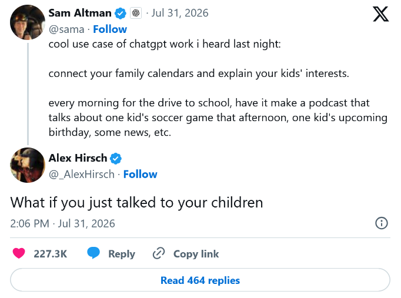

Hello, this is my first post, and to start things off I want to talk about something surely no one is tired of seeing or reading about: AI. As a developer, and someone who values art, creativity, and the field of computer science greatly, I feel obligated to make my views clear regarding AI - more specifically generative AI.

## What is generative AI?
Unfortunately, most of the time someone mentions AI nowadays, they are actually referring to generative AI and most commonly LLMs.

To quickly go over the actual definitions:

**Artificial Intelligence (AI)**: The field of computer science covering the methods, algorithms, and techniques that allow computers to learn, reason, and perform complex tasks that typically require human intelligence, such as understanding language and making predictions ([What is Artificial Intelligence? | Google Cloud](https://cloud.google.com/learn/what-is-artificial-intelligence)).

**Generative AI (GenAI)**: "Generative AI refers to deep-learning models that can generate high-quality text, images, and other content based on the data they were trained on." ([What is generative AI? | IBM Research](https://research.ibm.com/blog/what-is-generative-AI)).

**Large Language Model (LLM)**: A type of Generative AI that falls under the Natural Language Processing and Machine Learning (specifically Deep-Learning) subfields of AI. "An LLM is a type of AI model that excels at understanding and generating human language. They are trained on vast amounts of text data, allowing them to learn patterns, structure, and even nuance in language." ([What are LLMs? | Hugging Face](https://huggingface.co/learn/agents-course/en/unit1/what-are-llms))

*Now with that in mind, please ignore that I am a hypocrite and will refer to GenAI & LLMs as "AI" at certain points going forward.*

## Uses of LLMs
Let's start with the positives. Here are some things LLMs are good at:
- Summarization
- Classification 
- Semantic analysis
- Programming & technical tasks (to a point)
- Investigation & resource gathering, like finding web sources, books, and articles
- Research (like [cool math stuff](https://openai.com/index/model-disproves-discrete-geometry-conjecture/)) & academia to an extent
- Not being condescending, rude, or ever getting annoyed with questions
- Corporate-speak
	- If you've used LinkedIn, you know exactly what I mean

## Problems with LLMs
Nothing comes without a cost, so let's go over some negatives (forgive me for spamming links):

### The bad
- Sloppy code
	- Generated code that doesn't match project conventions, lacks foresight, includes pointless comments, isn't modular, and more generally is just hard to maintain or extend
- Sloppy writing
	- Writing that is overly dramatic, has repetitive phrasing (eg. "it's not x, it's y"), lacks emotion, and has a generic formal tone
- Cognitive decline (as researched by [MIT](https://arxiv.org/abs/2506.08872))
- [Socialization problems](https://pmc.ncbi.nlm.nih.gov/articles/PMC12805049/) & [AI psychosis](https://www.wsj.com/tech/ai/chatgpt-ai-stein-erik-soelberg-murder-suicide-6b67dbfb)
	- Case in point: 
- Environmental issues
	- [Explained: Generative AI’s environmental impact | MIT News](https://news.mit.edu/2025/explained-generative-ai-environmental-impact-0117)
	- [Rising Emissions, Depleting Water and Vanishing Land—UN Scientists: AI Is Threatening Natural Resources for Billions | UNU-INWEH](https://unu.edu/inweh/news/environmental-cost-of-AIs-Enrgy-use-carbon-water-and-land-footprints)
	- [The green paradox: The climate, environmental, and sustainability implications of artificial intelligence | Chouksey et al.](https://www.sciencedirect.com/science/article/pii/S2950138525000178)
- Theft of art, code, writing, and more
	- [Extracting memorized pieces of (copyrighted) books from open-weight language models | Feder Cooper et al.](https://arxiv.org/abs/2505.12546)
	- [Extracting books from production language models | Ahmed et al.](https://arxiv.org/abs/2601.02671)

### The super ugly
- Deepfakes & CSAM
	- [AI CSAM Report 2026: Harm Without Limits | IWF](https://www.iwf.org.uk/about-us/why-we-exist/our-research/how-ai-is-being-abused-to-create-child-sexual-abuse-imagery)
	- [Abuse at scale: Artificial intelligence is reshaping child sexual exploitation | Global Initiative](https://globalinitiative.net/analysis/abuse-at-scale-artificial-intelligence-is-reshaping-child-sexual-exploitation/)
	- [The continued influence of AI-generated deepfake videos despite transparency warnings | Simon Clark & Stephan Lewandowsky](https://pmc.ncbi.nlm.nih.gov/articles/PMC12848074/)
- Mass surveillance
	- [What are ALPRs? | DeFlock](https://deflock.org/what-is-an-alpr)
- Autonomous decisions & actions that affect human lives
	- [Anthropic boss rejects Pentagon demand to drop AI safeguards | BBC News](https://www.bbc.com/news/articles/cvg3vlzzkqeo)

## My thoughts
Given these uses and negatives, am I an AI evangelist? Am I completely against GenAI? Should you be one or the other? No, I don't think so. Like everything in life, it's not so black and white. 

Generative AI has the potential to cause great harm, and unfortunately there really isn't any going back. The cat is out of the bag.

*(The cat in question, who was initially in the bag)*

Some may find this to be a pessimistic view, but I really don't see AI going away anytime soon (as long as we have technology at least). Thus, we may as well adjust to this brave new world. Additionally, based on my experience and the experiences of people I know in the tech industry, AI usage is *heavily* encouraged by leadership and mandated at some places, so it's quite hard to escape in the professional world.

I'm not suggesting we surrender all original thought and use AI for everything. I simply think that we should use AI for what it is: a tool. Not as a replacement for our brains or other people, but a tool for making legitimately tedious and menial tasks easier, answering questions when no one else will, and accelerating what you are already good at.

### What GenAI should not be used for

##### Image, video, and audio generation
This may be a hot take, but I don't think that the everyday person should have access to image or video generation. I don't see any real benefit from its availability. Outside of researchers using non-text-based GenAI for things like [synthetic medical imaging generation](https://www.sciencedirect.com/science/article/pii/S258975002500072X), I see essentially no real reason for someone to generate images, videos, or even audio. 

I am a huge proponent of the arts and the human ingenuity, passion, work, and soul that goes into all forms of art, and thus am am very against AI "art", whether it be a poster, photo, video, novel, or song. Why are we so eager to automate and delegate away human creativity?

Some may think I'm hypocritical for thinking AI can be used for code generation, as they consider it art as well, which is a valid point. I understand seeing the elegance and craftmanship of code and considering it art, but to me, code is mostly a means to an end - a sequence of characters with the goal of running a calculation, propagating data across devices, or more generally executing a program. I think that code leans more closely to being a tool than to being art itself.

##### Replacing human connection
Honestly, I don't think AI should be used for anything interpersonal, including asking for relationship advice, treating it as a therapist, or similar. Generative AI is a tool, not a friend. 

##### Complete slop code
Full on vibe coding without human planning, review, etc. Basically please don't tell Grok: "Add a new feature that removes stale data, push changes to prod, make no mistakes".

##### Novels or articles in their entirety 
I can see some value in using GenAI for grammar fixes and such, but dear god if I have to read another article that uses 13 em-dashes and overly verbose text (while somehow still saying nothing), I'm going to abandon technology and become a monk.

##### Decisions that affect human lives
This should be pretty self-explanatory, but no AIs launching missiles and no mass surveillance driven by AI. 

### Some reasonable uses of GenAI

##### Code & technical tasks
- Code autocompletion
- Code review and security checks
- Documentation
- Agentic engineering, i.e. vibe coding but with consistent expert human input and review
	- This use of GenAI is more dangerous and more likely to create slop, but it can be fun to play around with and is useful for building prototypes extremely quickly
	- I think there are structured ways to produce good code using this method, but they have drawbacks and can be hard to set up
- Creating examples for functions & concepts
	- For unknown technical subjects, it can be useful to have the AI generate examples to help you better understand how something works
	- The best case is when the AI has access to documentation and uses it when creating examples, and then links you to the docs so you can review and confirm 

In general, I think using AI for code works best for small well defined problems (e.g. "Write a function to make struct *foo* comparable using x logic). Focusing on using AI to generate code that you could write yourself can help speed things up, while more vibe-coded projects can be for experimenting. 

> No matter what, all generated content should be reviewed by a human.

##### Learning 
- I don't think AI should actually teach you, and it certainly should not be used as a replacement for actual education, but it can be a great way to find resources, develop learning plans, and answer questions 24/7 (ideally using a trusted source, which you can then check)

##### Supporting & advancing research
- As linked earlier: [An OpenAI model has disproved a central conjecture in discrete geometry](https://openai.com/index/model-disproves-discrete-geometry-conjecture/) & [Exploring the potential of generative artificial intelligence in medical image synthesis: opportunities, challenges, and future directions | Khosravi et al.](https://www.sciencedirect.com/science/article/pii/S258975002500072X)
- [Generative AI in drug discovery and development: the next revolution of drug discovery and development would be directed by generative AI | Chakraborty et al.](https://pmc.ncbi.nlm.nih.gov/articles/PMC11444559/)
- More examples will hopefully come in the future!

##### Translation  
- Translating text or audio
- Converting code from one programming language to another

##### Data/pattern analysis
- Classification tasks
	- Give it a bunch of random text files and a list of possible categories, and the AI will probably do a good job at classifying them (without specific training needed)! 
- Semantic & sentiment analysis
	- As an example: Was a review positive or negative?
- Outlier detection

### How to be responsible with AI

#### Considerations
Before using GenAI, I think there are some important things to consider:
1. The potential for cognitive decline.
2. Transparency to others.

##### Losing your skill
A common consensus among forums, social media, and blog posts has been that consistently using GenAI for things like programming, writing, and analyzing atrophies your underlying skills. Anecdotally, after playing around for quite a while with coding assistants, I found I had to reach for documentation for common syntax significantly more than before. While the degradation of skills can be reversed, I think you should question if you are okay with getting worse at the task you are using GenAI for, and how long it may take to regain what was lost. 

##### Be honest
I think it's really important that anything that uses GenAI is transparent about its usage. **If GenAI is used, it should be disclosed**. If you are okay with using GenAI, that's fine, but I think you should respect those who don't want anything to do with projects, tools, or media created by or with GenAI. Disclosure allows those who aren't okay with it to make the choice to not use it.

To showcase this myself, when creating the theme for this website, I did most of the work myself, but I did use AI for some things such as finding and changing scattered instances of theme variables to the colors I wanted, setting up the search bar, and other minor things.

#### Responsible usage
I think there are some pretty useful and cool ways to use this technology, but it's not without any downsides, right? I already listed quite a few problems that come with AI, and I don't think they should be ignored. I instead think that we should work to minimize the downsides and maximize the real value as much as possible.

Some ways you can do this:
- Use local AI! The work has already been done to create these models, so the only impact now is your electricity bill. I'm planning to write about local AI in the future, so stay tuned.
- Don't support the corporations, labs, or other entities that are causing the most harm. Personally, I don't pay for any subscriptions to OpenAI, X, or any specific AI brand.
	- I do have to use Anthropic models for work, and while I do appreciate their focus on safety and seemingly trying to be slightly less evil than the others, I'm still not a huge fan.
	- When I do use cloud AI providers, I essentially only use hosted open weight models like GLM, DeepSeek, MiniMax, and Qwen. Despite fears of the Chinese government, these models can be hosted by anyone with a powerful enough computer.
- Say no to datacenters in your area. Sign petitions, go to board meetings, and keep up with what is happening in your community.
- Use AI where it is actually useful or needed. There is no need to waste resources (and your capacity for thinking) when it's not needed. As a developer who often focuses on automating things, I always try to solve a problem or automate something in a deterministic way; GenAI is a last resort and often adds excessive complexity.
